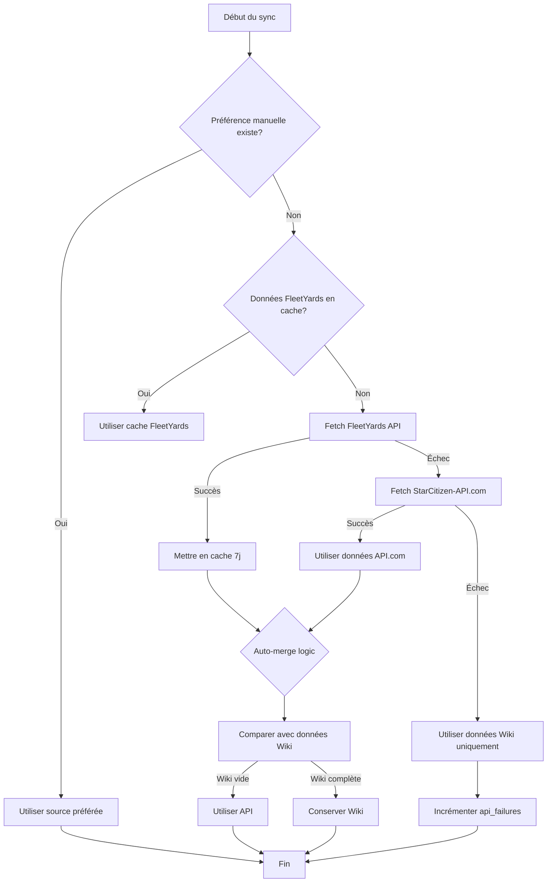

# Ships Sync Function

## Vue d'ensemble

Cette edge function synchronise les données des vaisseaux Star Citizen depuis plusieurs sources externes vers la base de données Supabase. Elle gère automatiquement la mise en cache, le fallback entre sources, et les préférences manuelles des administrateurs.

## Architecture

### Sources de données

La fonction utilise trois sources de données principales, organisées en hiérarchie de fallback :

1. **Star Citizen Wiki** (Source de base)
   - URL : `https://starcitizen.tools/`
   - Type : Parsing HTML/Wikitext
   - Fiabilité : ⭐⭐⭐ (Toujours disponible mais données moins structurées)
   - Couverture : 100% des vaisseaux
   
2. **FleetYards.net API** (Source préférée)
   - URL : `https://api.fleetyards.net/v1/`
   - Type : API REST JSON
   - Fiabilité : ⭐⭐⭐⭐ (Très stable, données officielles)
   - Cache : 7 jours dans `fleetyards_cache`
   - Couverture : ~80-90% des vaisseaux avec armement/systèmes détaillés
   
3. **StarCitizen-API.com** (Fallback)
   - URL : `https://api.starcitizen-api.com/`
   - Type : API REST JSON
   - Fiabilité : ⭐⭐⭐ (Nécessite clé API)
   - Couverture : ~70-80% des vaisseaux
   - Secret requis : `STARCITIZEN_API_COM_KEY`

## Hiérarchie de décision



## Auto-merge Logic

Lorsqu'aucune préférence manuelle n'est définie, la fonction applique une logique d'auto-merge :

1. **Si données Wiki sont vides ou incomplètes** :
   - Utiliser les données FleetYards/API pour `armament` et `systems`
   - Conserver les autres champs du Wiki (manufacturer, role, dimensions, etc.)

2. **Si données Wiki sont complètes** :
   - Conserver les données Wiki
   - Stocker les données API dans `raw_fleetyards_data` pour comparaison future

3. **Détection de complétude** :
   ```typescript
   const wikiHasArmament = Object.values(armament || {}).some(arr => arr.length > 0);
   const wikiHasSystems = Object.values(systems || {}).some(group => 
     Object.values(group || {}).some(arr => arr.length > 0)
   );
   ```

## Système de cache

### Table `fleetyards_cache`

```sql
CREATE TABLE fleetyards_cache (
  id SERIAL PRIMARY KEY,
  ship_slug TEXT UNIQUE NOT NULL,
  data JSONB NOT NULL,
  fetched_at TIMESTAMPTZ DEFAULT NOW(),
  expires_at TIMESTAMPTZ DEFAULT (NOW() + INTERVAL '7 days'),
  created_at TIMESTAMPTZ DEFAULT NOW()
);
```

### Politique d'expiration

- **Durée de vie** : 7 jours
- **Vérification** : À chaque sync, on vérifie `expires_at`
- **Refresh** : Si expiré, nouvelle requête API et update du cache
- **Nettoyage** : Pas de nettoyage automatique (cache relativement petit)

## Préférences manuelles

Les administrateurs peuvent forcer l'utilisation d'une source spécifique via la table `ship_data_preferences` :

```typescript
interface ShipDataPreference {
  ship_slug: string;
  preferred_source: 'wiki' | 'fleetyards' | 'auto';
  set_by: UUID; // Admin user ID
  set_at: TIMESTAMPTZ;
  reason?: string;
}
```

### Utilisation

Via l'interface admin (`/admin` → onglet "Ship Data") ou via l'edge function `ship-data-override` :

```typescript
POST /functions/v1/ship-data-override
{
  "ship_slug": "anvil-hornet",
  "preferred_source": "fleetyards",
  "reason": "FleetYards data is more accurate for this ship",
  "clear_cache": true
}
```

## Logging et monitoring

### Sources de logs

1. **Console logs**
   - Disponibles dans Supabase Dashboard → Edge Functions → ships-sync → Logs
   - Détails de chaque étape du sync
   - Warnings et erreurs

2. **Table `cron_job_history`**
   ```sql
   job_name: 'ships-sync'
   status: 'success' | 'failed' | 'running'
   items_synced: INTEGER -- Nombre de ships upsertés
   duration_ms: INTEGER
   error_message: TEXT
   ```

3. **Table `audit_logs`**
   ```typescript
   {
     action: 'auto_sync_ships' | 'manual_sync_ships',
     target: 'ships',
     meta: {
       source: 'cron' | 'admin_panel',
       total_vehicles: number,
       upserts: number,
       errors: number,
       data_sources: {
         wiki: number,
         fleetyards: number,
         starcitizen_api: number,
         wiki_fallback: number,
         api_failures: number,
         manual_preference: number
       },
       api_failure_rate: number, // Pourcentage
       timestamp: ISO8601,
       force: boolean
     }
   }
   ```

### Alertes automatiques

Si **plus de 50% des ships échouent** à récupérer des données API :

```typescript
{
  action: 'api_failure_alert',
  target: 'ships_sync',
  meta: {
    failure_rate: 67.3, // Pourcentage
    total_failures: 89,
    total_vehicles: 132,
    source_counts: { ... },
    timestamp: ISO8601
  }
}
```

## Mécanisme de lock

Pour éviter les exécutions concurrentes, la fonction utilise un système de lock :

```typescript
// Acquire lock (30 minutes max)
const locked = await supabase.rpc('acquire_function_lock', {
  p_function_name: 'ships-sync',
  p_lock_duration_seconds: 1800
});

if (!locked) {
  // Autre instance déjà en cours
  return { status: 409, message: 'Already running' };
}

// ... processing ...

// Release lock
await supabase.rpc('release_function_lock', {
  p_function_name: 'ships-sync'
});
```

## Détection de ships "Flight Ready"

La fonction détecte automatiquement quand un vaisseau devient "flight ready" et enregistre la date dans `flight_ready_since` :

```typescript
const isFlightReady = production_status?.toLowerCase().includes('flight ready') ||
                      production_status?.toLowerCase().includes('released') ||
                      production_status?.toLowerCase().includes('flyable');

if (isFlightReady && !existingShip?.flight_ready_since) {
  payload.flight_ready_since = new Date().toISOString();
}
```

## Optimisation des performances

### Hash-based updates

Seuls les vaisseaux avec des changements réels sont mis à jour :

```typescript
const hash = sha256(stableStringify({
  ...vehicle,
  image_url: undefined, // Exclu des changements
  model_glb_url: undefined
}));

if (existingShip?.hash === hash && !force) {
  // Skip update
  continue;
}
```

### Batch processing

Pas de batching actuellement, chaque vaisseau est traité individuellement pour :
- Meilleure gestion d'erreurs
- Logs détaillés par vaisseau
- Éviter les timeouts sur gros volumes

## Configuration CRON

Pour exécuter automatiquement toutes les 6 heures :

```sql
SELECT cron.schedule(
  'ships-sync-every-6h',
  '0 */6 * * *', -- Toutes les 6 heures
  $$
  SELECT net.http_post(
    url := 'https://djmzthmmgjlkfgwkawzi.supabase.co/functions/v1/ships-sync',
    headers := '{"Content-Type": "application/json", "Authorization": "Bearer YOUR_ANON_KEY"}'::jsonb,
    body := '{"auto_sync": true}'::jsonb
  ) AS request_id;
  $$
);
```

## Dépannage

### Problème : Tous les ships échouent à sync

1. Vérifier que `STARCITIZEN_API_COM_KEY` est configuré
2. Vérifier les logs FleetYards API (rate limiting ?)
3. Vérifier la connexion au Wiki (`curl https://starcitizen.tools/api.php`)

### Problème : Cache ne se remplit pas

1. Vérifier RLS policies sur `fleetyards_cache`
2. Vérifier que `SUPABASE_SERVICE_ROLE_KEY` est utilisé
3. Logs : rechercher "Error caching FleetYards data"

### Problème : Lock ne se libère jamais

Si la fonction crash sans libérer le lock :

```sql
DELETE FROM edge_function_locks 
WHERE function_name = 'ships-sync';
```

Ou attendre l'expiration automatique (30 minutes).

## Maintenance

### Nettoyage des raw_*_data

Les champs `raw_wiki_data`, `raw_fleetyards_data`, `raw_starcitizen_api_data` peuvent devenir volumineux.

Une fonction de nettoyage existe : `cleanup-raw-data`

Elle supprime les raw data pour les ships non mis à jour depuis 30+ jours.

### Mise à jour des secrets

```bash
# Via Supabase Dashboard
Settings → Edge Functions → Secrets

# Ou via CLI
supabase secrets set STARCITIZEN_API_COM_KEY=your_key_here
```

## Points d'attention futurs

- [ ] Implémenter un système de notification (email/webhook) pour les alertes
- [ ] Ajouter des métriques Prometheus/Grafana
- [ ] Considérer un batch processing pour >500 ships
- [ ] Implémenter un système de retry exponential backoff pour les APIs
- [ ] Ajouter un endpoint de health check
